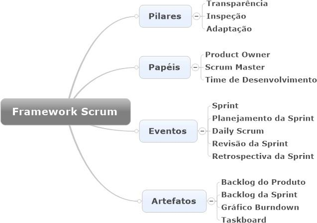

# Como fazer Metodologias Ágeis – Scrum e Kanban na Prática

O manifesto ágil surgiu com a insatisfação dos profissionais de desenvolvimento de software com modelo cascata (Utilizado pricipalmente nas engenharias para o gerenciamento de um projeto).

Ele é composto por:

- 4 valores ágeis:
  1. Indivíduos e Interações Mais que Processos e Ferramentas;
  2. Software em Funcionamento mais que Documentação Abrangente;
  3. Colaboração com o Cliente mais que Negociação de Contratos;
  4. Responder a Mudanças mais que Seguir um Plano.
   
- 12 princípios ágeis:
  1. Nossa prioridade é satisfazer o cliente, através da entrega adiantada e contínua de software de valor;
  2. Aceitar mudanças de requisitos, mesmo no fim do desenvolvimento. Processos ágeis se adequam a mudanças, para que o cliente possa tirar vantagens competitivas;
  3. Entregar software funcionando com frequência, na escala de semanas até meses, com preferência aos períodos mais curtos;
  4. Pessoas relacionadas à negócios e desenvolvedores devem trabalhar em conjunto e diariamente, durante todo o curso do projeto;
  5. Construir projetos ao redor de indivíduos motivados. Dando a eles o ambiente e suporte necessário, e confiar que farão seu trabalho;
  6. O Método mais eficiente e eficaz de transmitir informações para, e por dentro de um time de desenvolvimento, é através de uma conversa cara a cara;
  7. Software funcional é a medida primária de progresso;
  8. Processos ágeis promovem um ambiente sustentável. Os patrocinadores, desenvolvedores e usuários, devem ser capazes de manter indefinidamente, passos constantes;
  9. Contínua atenção à excelência técnica e bom design, aumenta a agilidade;
  10. Simplicidade: a arte de maximizar a quantidade de trabalho que não precisou ser feito;
  11. As melhores arquiteturas, requisitos e designs emergem de times auto organizáveis;
  12. Em intervalos regulares, o time reflete em como ficar mais efetivo, então, se ajustam e otimizam seu comportamento de acordo.
  
# Framework Scrum

- Framework para gerenciamento de projetos ágeis focado nas pessoas;
- Poderá tratar e resolver problemas em níveis de complexidade alta e adaptativos;
- Um ponto fundamental do conceito ágil é centralizar o cliente no processo, ou seja, gerar valor ao cliente é fundamental para o sucesso de cada entrega e assim de todo backlog

  

## Pilares
**Tranparência**:
Escrever algo aqui

**Inspeção**:

**Adaptação**:

## Papéis
**Product Owner(P.O)**: Responsável pelo produto. Ligação entre o cliente e o time de desenvolvimento.

**Scrum Master**: Especialista em Scrum. Garante a metodologia ágil seja aplicadas em toda a empresa.

**Time de Desenvolvimento**: Formado de 3 a 9 integrantes. Responsável pelas entregas dos itens do produto.

## Eventos

**Sprint**: 

**Planejamento da Sprint**:

**Daily Scrum**:

**Revisão da Sprint**:

**Retrospectiva da Sprint**:

## Artefatos

**Backlog do produto**:

**Backlog da Sprint**:

**Gráfico de Burndown**:

**Taskboard**: